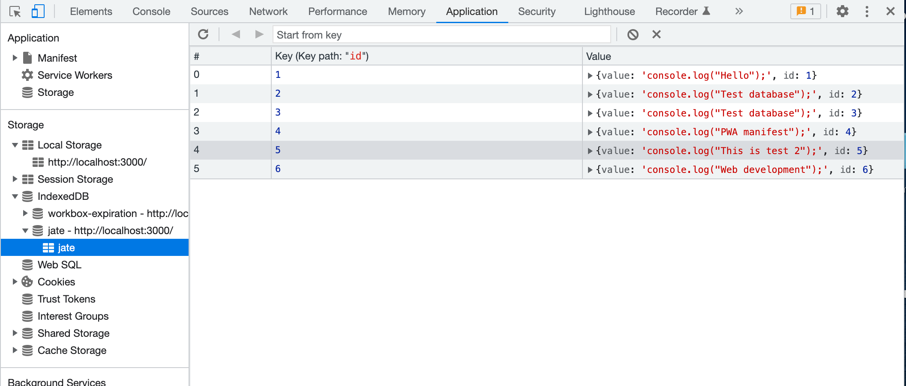

# pwa-text-editor

# Description

The application is a web text editor where the user can create notes with or without an internet connection and later be able to retrieve them. 

# Installation

Clone the pwa-text-editor repository to your local machine. Start the application using the `npm run start:dev` command 

# User Story

AS A developer
I WANT to create notes or code snippets with or without an internet connection
SO THAT I can reliably retrieve them for later use

# Usage

The following image demonstrates the application functionality:

The following image shows the application's manifest.json file:

The following image shows the application's registered service worker:

The following image shows the application's IndexedDB storage:

# Link to deployed heroku application

https://blooming-everglades-09901.herokuapp.com/